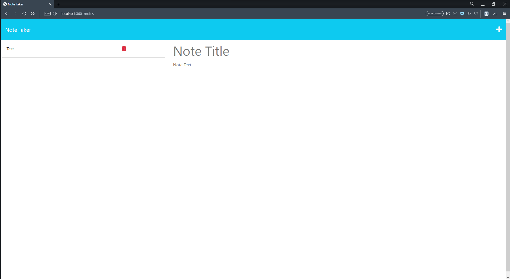

# Notebook

## Description

I have been expanding my knowlage about nodejs and I came accross this application called express. Express is an application that helps in hosting your web application. Express gives us the possiblity to listen to https requests. Once we get those requests we can respond back and change data if needed here on the server side. The desire to get more experiance with express led to the creation of the Notebook project. The Notebook is an application that displays and holds in notes for users. There is the functionality of adding in new notes. Deleting notes is also possible for users. The application made is a cool tool to help people keep track of notes here digitally without the need of going out to buy a notebook. This is a little simple application though, so only text can be saved. While working on this project I got to see how to build paths to access data that users can use. Also the concept of middleware in express helped us in accessing certain parts of our application. In this project we did not use mysql or a database type of program for storying data. Json was used for storing data. Since I was using json for storing data I got to deal with parsing and stringifying data in the project. Then the nodejs file system was used to get and store data for notes in a json file. All of this was used to build the project Notebook.

## Installation

Now to run this project you will need to install nodejs. I will include the link to get nodejs below. When downloading nodejs just make sure you get the proper version for your device.

    Nodejs Installation Link: https://nodejs.org/en/download

After installing nodejs you will need to install express and uuid library for this project. I should have the correct library in the package.json file, so all you need to do is enter in the following command in you terminal at the project folder location.

    npm install

If the previous command does not work you can use this other command to install express and the second command to install uuid.

    npm install express
    npm install uuid

## Usage

The image above is the home page of this web application. The webpage only has two other paths for users to naviagte too. Those other paths let users either get, post, or delete data from the main server database. Any other paths not regconized by the server will redirect users to the home page. The home page has a button on it to led users to the notebook page.

The notes webpage will get notes saved from the server's database. The notes are displayed on the left hand side of the screen and if a user clicks on one of the notes the current note displayed will be changed to the clicked note. The notes webpage when first loaded will give users the option to make a new note by giving users two input boxes. if you look at the image above you will notice one other icon that acts like a button for users. The button will clear the current input boxes to make a note. No note can be saved until text is entered into both text boxes. 

Once both input boxes have been filled a new icon will appear right next to the other one on the top right hand of the screen. The new icon if clicked will dave the note information from the input boxes and make a new entery into the notes database. Any errors that occur will not be displayed on the client side. The server side itself is were errors are displayed. Another button to mention on the notes webpage is the trash icon on the notes displayed on the left. If the user clicks on the trash icon it will delete the note attached to that icon. One more thing to mention is that sometimes it takes a second or two to complete requests being made, so if you are loading, saveing, or deleteing something on the notes webpage we need to wait till that request is met to see changes.

Here is a link to the webpage: https://notebook-app.herokuapp.com

## Credits

Thank you to nodejs, us davis bootcamp, express, and uuid in helping build my application.*Nodejs helped in providing the file system used to build the application.*Thank you to UC Davis Bootcamp for providing font end code of this project*Thank you to express for helping in handeling https requests*UUID for providing randomized ids' created in this project

## License

The project is covered by the MIT license. Please refer to the repo for more information on the license. The link below we will link users to the template followed to make license.

License Link: https://spdx.org/licenses/MIT.html

## Badges

## Tests

N/A

## Questions

Any questions you may have you can contact me through my email shown below and there is a link to my github account.

Email: gvv8106@gmail.com

GitHub Profile: https://github.com/Giovanne-Villanueva
